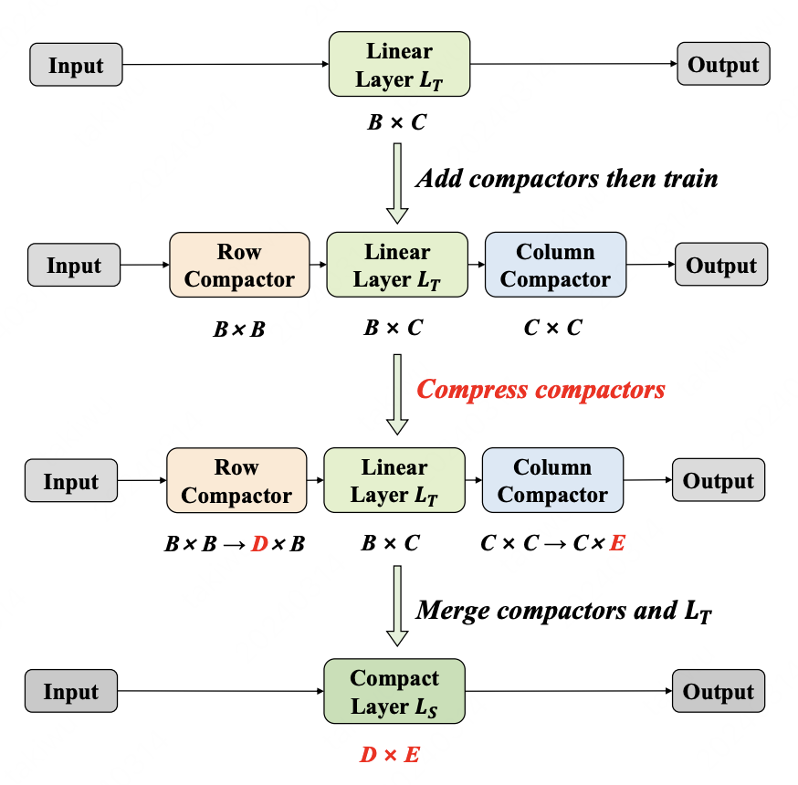

This repo contains the code for our NAACL 2024 findings paper:
<a href="https://arxiv.org/abs/2305.09098" target="_blank">Weight-Inherited Distillation for Task-Agnostic BERT Compression</a> by <a href="https://wutaiqiang.github.io" target="_blank">Taiqiang Wu</a>, Cheng Hou,  Shanshan Lao, Jiayi Li, Ngai Wong, Zhe Zhao, Yujiu Yang.

There is an <a href="https://zhuanlan.zhihu.com/p/687294843" target="_blank"> explaination blog </a> for this paper (in Chinese).

## Overview

Task: PLM compression

Motivation: 

Selecting various loss functions and balancing the weights of each loss are laborious. Meanwhile, the knowledge is embedded in the weights. So
**can we distill the knowledge by directly inheriting the weights, rather than aligning the logit distributions or intermediate features?**

Design:

Inspired by structural re-parameterization in CNN compression, we design row compactors and column compactors, and then view them as mappings to compress the weights by row and column, respectively.


<div align=center>

</div>

Both row compactor and column compactor are initialized as identity matrices. After training, we compress the compactors and merge them with the original layer. All the linear layers in the teacher model are compressed simultaneously.


## Reproduction
### Environment
Run this to create a conda env:
```
pip install -r requirements.txt
```

### Data Preprocess

We use the documents of English Wikipedia and BookCorpus as the training data and preprocessed the raw data by the following scripts.

```
python3 preprocess.py --corpus_path bert_corpus.txt --vocab_path models/google_uncased_en_vocab.txt --dataset_path bert_corpus_dataset.pt --processes_num 32 --dynamic_masking --data_processor mlm
```

Then you will get the processed dataset file.
Please refer to https://github.com/dbiir/UER-py/wiki/Instructions for more details.

### Teacher Model

Download the teacher model in https://github.com/google-research/bert. 
Then convert the model file to UER format using https://github.com/dbiir/UER-py/blob/master/scripts/convert_bert_from_huggingface_to_uer.py

### WID Training

We have two compression strategies, dropping head and reducing dimension.
Take compress 12-768 teacher model to 12-192 student model as an example.

The following scripts is for **reducing dimension**.

```
python3 pretrain.py --dataset_path bert_corpus_dataset.pt \
	--pretrained_model_path models/google/12-768-model.bin \
	--vocab_path models/google_uncased_en_vocab.txt \
	--config_path bert/base_config.json \
	--output_model_path models/12-192-reduce-dim-stage1.bin \
	--world_size 8 --gpu_ranks 0 1 2 3 4 5 6 7 \
	--warmup 0.01 --data_processor mlm --total_steps 400000 \
	--save_checkpoint_steps 100000 --learning_rate 1e-6 \
	--batch_size 120 --target mlm --tb_path logs/12-192-reduce-dim.log \
	--target_dim 192 --compactor_mask_strategy dim \
	--l2_lambda 20 --weight_squeeze --compactor_learning_rate 5e-5 \
	--w_step 500 --mask_path mask_path/12-192-reduce-dim.txt
```
The meaning of some parameters is as follows:

dataset_path: path of processed dataset file

pretrained_model_path: path of converted teacher model

output_model_path: output path

world_size: gpu numbers

total_steps: training steps

tb_path: place to save tensorboard file and logs file

target_dim: dimension of the student model

compactor_mask_strategy: **reducing dimension** or **dropping head**, strategy to compress Multi-head attention

mask_path: path to save generated mask


The following scripts is for **dropping head**.

```
python3 pretrain.py --dataset_path bert_corpus_dataset.pt \
	--pretrained_model_path models/google/12-768-model.bin \
	--vocab_path models/google_uncased_en_vocab.txt \
	--config_path bert/base_config.json \
	--output_model_path models/12-192-drop-head-stage1.bin \
	--world_size 8 --gpu_ranks 0 1 2 3 4 5 6 7 \
	--warmup 0.01 --data_processor mlm --total_steps 400000 \
	--save_checkpoint_steps 100000 --learning_rate 1e-6 \
	--batch_size 120 --target mlm --tb_path logs/12-192-drop-head.log \
	--target_dim 192 --compactor_mask_strategy head \
	--l2_lambda 20 --weight_squeeze --compactor_learning_rate 5e-5 \
	--w_step 500 --mask_path mask_path/12-192-drop-head.txt
```

### Merge Compactors

After pre-training, we use the following scripts convert the sparse model with compactors to the dense model.

For **reducing dimension**:

```
python3 convert.py --load_model_path models/12-192-reduce-dim-stage1.bin-400000 \
	--layers_num 12 --hidden_size 768 \
	--compactor_mask_strategy dim \
	--mask_path mask_path/12-192-reduce-dim.txt --mask_step 400000 \
	--output_model_path models/12-192-reduce-dim-model.bin
```

For **dropping head**:

```
python3 convert.py --load_model_path models/12-192-drop-head-stage1.bin-400000 \
	--layers_num 12 --hidden_size 768 \
	--compactor_mask_strategy head \
	--mask_path mask_path/12-192-drop-head.txt --mask_step 400000 \
	--output_model_path models/12-192-drop-head-model.bin
```

###  Downstream Tasks

Then we can use the merged model to fine-tune. Please follow https://github.com/dbiir/UER-py/wiki/GLUE to test on GLUE.


## Citation

Please cite our paper if you find this paper helpful

```
@article{wu2023weight,
  title={Weight-inherited distillation for task-agnostic bert compression},
  author={Wu, Taiqiang and Hou, Cheng and Zhao, Zhe and Lao, Shanshan and Li, Jiayi and Wong, Ngai and Yang, Yujiu},
  journal={arXiv preprint arXiv:2305.09098},
  year={2023}
}
```


## Contact

If you have any question, please contact via github issue or email me through takiwu(AT)connect.hku.hk

---
This code is modified based on <a href="https://github.com/dbiir/UER-py" target="_blank"> UER </a>, we thank for their efforts.


